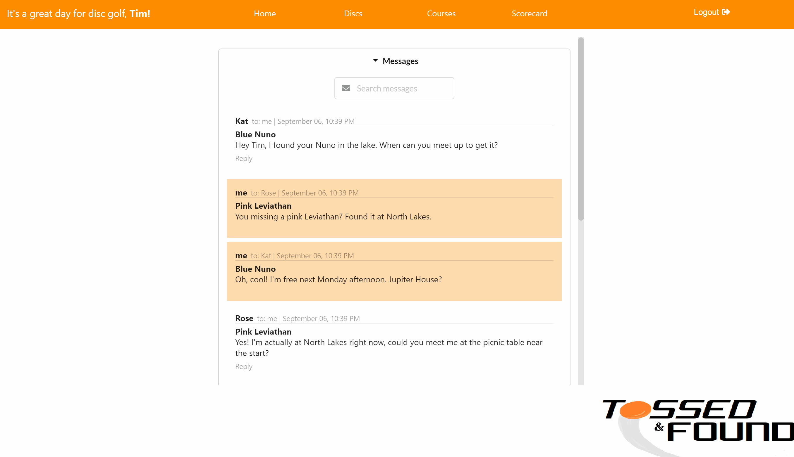

# Tossed and Found

If you're a disc golfer, chances are you've spent a fair amount of time searching for a disc after the occasional wayward throw. Sometimes, you don't find it. Maybe your disc ended up in a pond, or it's gotten too dark to see, or perhaps you just plain overlooked it. Some disc golfers will write their phone number on the back of their discs in the hopes that someone will find them and kindly reach out to return them if they're ever lost. But what if you aren't comfortable with putting your personal information out there for just anyone to happen across? Tossed and Found is a disc golf companion app that aims to provide a solution to that issue. When you add your discs to your Tossed and Found account, they are assigned a unique finder key that you can then write on the back of your disc instead of your phone number. If another user finds your disc, they can look it up by entering this key in the search, and reach out via instant message so you can arrange a time and place (preferably public!) to retrieve your disc. Tossed and Found also functions as a scorekeeper, and has a publicly sourced course catalog that displays the top 3 scores for each.
<br/>
<b>Click [here](https://youtu.be/K-DG0ddg90s) for a video demonstration!</b>

## Requirements
- [Ruby](https://www.ruby-lang.org/en/downloads/)
- [Bundler](https://bundler.io/)
- [NodeJS & npm](https://docs.npmjs.com/downloading-and-installing-node-js-and-npm)
- [postgreSQL](https://www.postgresql.org/download/)

## Installation
**<b>If you would like to skip this and just check out the app, see the Usage section.</b>
- In this application's GitHub repo, click the fork button to create a copy for yourself. Next, in your own fork, click the 'Code' button, make sure SSH is selected, and copy what's there.<br>
- Head into your CLI (Command Line Interface) and navigate to the directory where Tossed & Found will live. Then run the following commands in order:
```shell
~your-computer/cool-apps$ git clone (the SSH you copied)
~your-computer/cool-apps$ cd tossed-and-found
~your-computer/cool-apps/tossed-and-found$ bundle install
~your-computer/cool-apps/tossed-and-found$ npm install --prefix client
~your-computer/cool-apps/tossed-and-found$ sudo service postgresql start
``` 
If the last command gives you issues, make sure you have postgreSQL installed with:
```shell
psql --version
```
If you need additional help or instructions, you can go [here](https://docs.microsoft.com/en-us/windows/wsl/tutorials/wsl-database#install-postgresql) for WSL or [here](https://www.codementor.io/@engineerapart/getting-started-with-postgresql-on-mac-osx-are8jcopb) for OSX.

## Usage
If you've installed Tossed & Found on your machine using the instructions above, you're going to need two terminals open.
In the first one, type:
```shell
~your-computer/cool-apps/tossed-and-found$ rails s
```
This will start the back end on http://localhost:3000. And for the front end (running on http://localhost:4000), the command is:
```shell
~your-computer/cool-apps/tossed-and-found$ npm start --prefix client
```
Alternatively, Tossed & Found is deployed [here](https://tossed-and-found.herokuapp.com/) if you want to try it out that way.* You can log in as Tim (password is tim123) to see what everything looks like when it is filled out.
Using Tossed & Found is pretty straightforward; you can add your discs, courses that you play at, and start scorekeeping a round (after selecting a course) from the navigation bar. The Home page gives you access to your messages, personal scores, and the marquee feature, the disc return.
<br><br>

<br><br>
*You are free to create an account here, but be aware that this is more of a demo and not the final version, thus I may be wiping the database a few times. If you want your data to be safe, install and run the app locally. 

## Contributing
Pull requests are welcome. For major changes, please open an issue first to discuss what you would like to change.

## Roadmap
Obviously, a whole lot of work is left to be done to transform this side project into a legitimate app. Those goals will be outlined here.
Future additions/changes:

- Fix duplicate user courses

- Implement a system that encourages and rewards returning lost discs. Users with a certain community standing may receive invites to exclusive tournaments and events, or special offers from sponsors.

- Fleshed out user profiles.

- Add user email for password recovery and such.

- Allow for further disc editing (at least allow users to update the image URL).

- Image uploading for discs, and potentially user profiles and courses.

- Vastly improved Courses section, with maps, location services, a search feature, and a filter to show the courses nearest to the user first. New course submissions will have to be approved before they are added.

- Better looking UI and logo. Flexible and comprehensive styling for different viewports.

- Better messaging; users can delete messages, and don't have to refresh the page to see new ones.

- Allow users to print out QR code stickers to place on their discs in lieu of writing down their code. Though losing a disc in a pond would be troublesome for ordinary stickers... well, it's a discussion to be had if this ever goes that far.

## Acknowledgements
- Tossed and Found utilizes styled components from [Semantic UI React](https://react.semantic-ui.com/).
- Application front end created using [Create React App](https://create-react-app.dev/).
- Image sources, in the order that they appear in dataArray.js:
    - https://crs4rec.com/disc-golf/
    - https://www.si.com/golf/news/nine-must-play-disc-golf-courses-yes-disc-golf
    - https://en.wikipedia.org/wiki/Disc_golf
    - https://en.wikipedia.org/wiki/Disc_golf_in_the_United_States
    - https://www.michigan.org/article/trip-idea/fantastic-disc-golf-courses-michigan
    - https://www.reddit.com/r/discgolf/comments/hcej13/best_view_in_disc_golf_dillion_colorado/


## License
[MIT](https://choosealicense.com/licenses/mit/)
